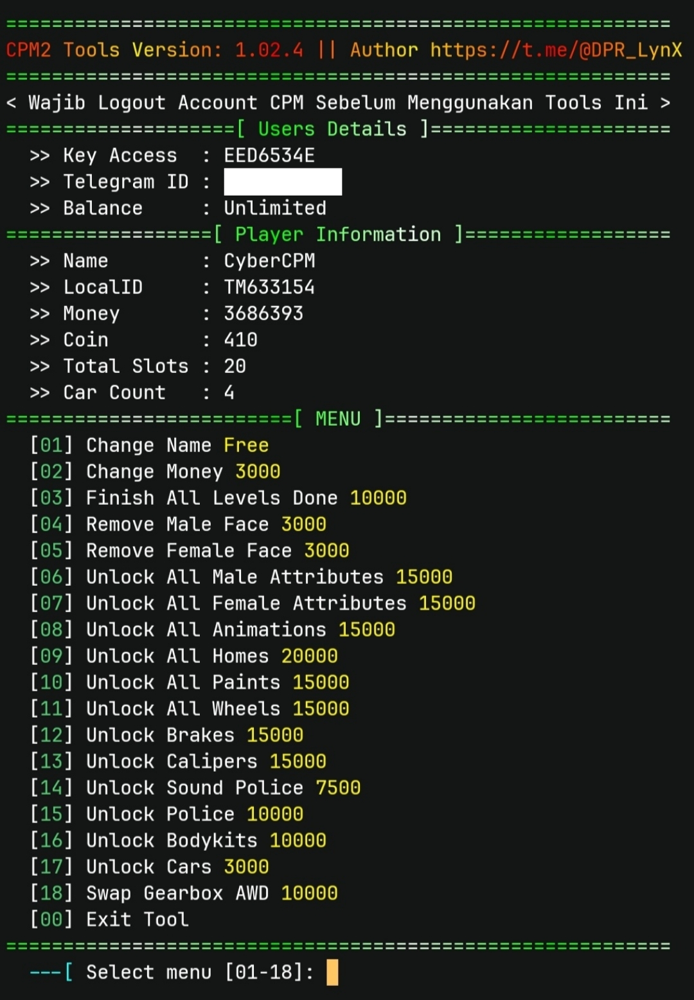

<!DOCTYPE html>
<html lang="en">
<head>
  <meta charset="UTF-8" />
  <meta name="viewport" content="width=device-width, initial-scale=1.0"/>
  <title>CyberCPM - Modern Tool</title>
  
</head>
<body>

  <h1>🚗 CyberCPM</h1>
  
CyberCPM is a powerful tool made to <strong>modify Car Parking Multiplayer 2 accounts</strong> easily — <em>no root or virtual app required</em>.

  
You only need an <strong>Access Key</strong>, which you can get from 
    <a href="https://t.me/CyberCPMbot" target="_blank">@CyberCPMbot</a> for free with <strong>1K Credits</strong> balance.
  

  

  

    <h2>✅ Tested On</h2>
    <ul>
      <li><strong>iPhone</strong> (via <code>ish</code>)</li>
      <li><strong>Android</strong> (via <code>Termux</code>)</li>
      <li><strong>Windows</strong></li>
      <li><strong>Linux</strong></li>
    </ul>
  

  

    <h2>⚙️ Installation</h2>
    <pre><code>git clone https://github.com/CyberCPM/cybercpm.git
cd cybercpm
pip install -r requirements.txt
python main.py</code></pre>
  

  

    <h2 id="install-python">🐍 Install Python</h2>

    
Termux

    <pre><code>apt update && apt upgrade -y
pkg install python -y
pkg install python-pip</code></pre>

    
Linux

    <pre><code>sudo apt install python
sudo apt install python-pip</code></pre>

    
Windows

    
Download Python from <a href="https://www.python.org/downloads/" target="_blank">python.org</a>

    <pre><code>py -3 -m pip install -r requirements.txt
py -3 main.py</code></pre>
  

</body>
</html>